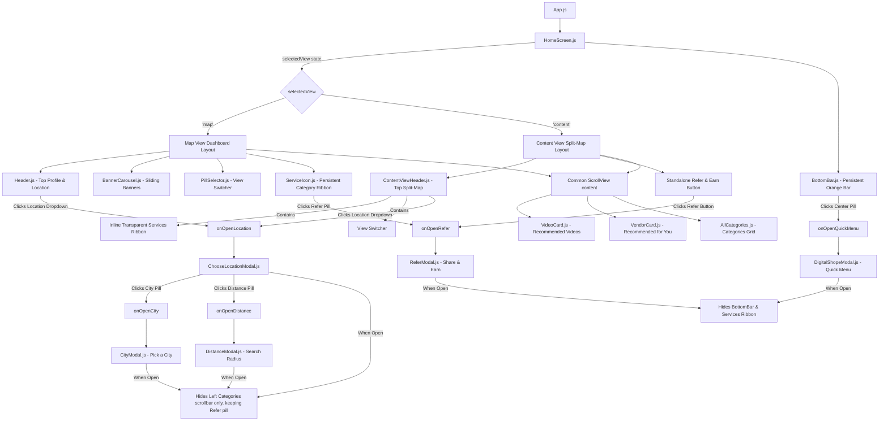

# KaroOnline - Mobile Dashboard & Views

A high-fidelity React Native (Expo) mobile application implementing a fluid split-view dashboard: **Map View** and **Content View**, equipped with dynamic bottom drawers (slide-up overlays) for location selection, city directory browsing, search radius configurations, quick links, and sharing rewards.

---

## 🛠️ Setup & Installation

Follow these steps to run the application locally:

### 1. Prerequisites
Ensure you have **Node.js** and **Expo CLI** installed.

### 2. Installation
Install the necessary React Native & Expo packages:

```bash
# Clone the repository (or navigate to your root directory)
cd Karo_Online

# Install standard dependencies
npm install

# Install specific required Expo modules
npx expo install react-native-safe-area-context expo-linear-gradient @expo/vector-icons expo-status-bar
```

### 3. Running the App
Start the Metro bundler to run the application in an emulator or web preview:

```bash
# Start Metro bundler
npm start

# Or specifically run on web
npm run web
```

---

## 📊 Design & Implementation Flowchart

Here is the flowchart representing the views, user interactions, and drawer overlay state routing in `HomeScreen.js`:



---

## 📂 Project Structure Map

Here is a map of the file layout created for the implementation:

```text
Karo_Online/
├── src/
│   ├── theme/
│   │   └── colors.js                 # Branding color tokens (Primary Orange, Cream Background)
│   ├── constants/
│   │   └── data.js                   # Mock data, cartoon icons Twemoji URLs, fallback emojis
│   ├── components/
│   │   ├── Header.js                 # Standard Header with Profile & Location selector
│   │   ├── BannerCarousel.js         # Auto-scrolling horizontal banner cards
│   │   ├── PillSelector.js           # Floating View Switcher pill (Content / Map)
│   │   ├── VideoCard.js              # Video card layout with duration and tailors info
│   │   ├── VendorCard.js             # Vendor card supporting text emojis & cartoon graphic modes
│   │   ├── AllCategories.js          # Categories Grid (4 columns percentage-based)
│   │   ├── ServiceIcon.js            # Floating categories ribbon bar (supports transparent/floating/hiding modes)
│   │   ├── CategoriesModal.js         # Slide-up All Categories drawer (height limited to 65% of screen)
│   │   ├── BottomBar.js              # Orange custom bottom navigation bar
│   │   ├── ChooseLocationModal.js    # Legacy location drawer refactored under search folder
│   │   ├── ContentView/
│   │   │   └── ContentViewHeader.js  # Top split-map header containing inline categories ribbon
│   │   ├── digitalShope/
│   │   │   └── digitalShope.js       # Quick Menu drawer modal (contains horizontal scrollable list of 5 apps)
│   │   ├── Refer/
│   │   │   └── Refer.js              # Refer & Earn drawer modal (QR, Sharing action buttons, Wallet link)
│   │   ├── search/
│   │   │   └── ChooseLocationModal.js # Refactored Location drawer (City & distance triggers)
│   │   └── city/
│   │       ├── city.js               # Pick a City modal drawer grid
│   │       └── distance.js           # Search Radius drawer modal grid
│   └── screens/
│       └── HomeScreen.js             # Root page coordinating modal toggles & lifted states
└── App.js                            # Injects Metro root HTML/Body reset styles on web
```

---

## ⚙️ Key State Management

### 1. View Toggling (`selectedView`)
Maintained inside `HomeScreen.js`. Toggles between standard Map Dashboard (`'map'`) and Split-Screen layout (`'content'`).

### 2. Search Radius Lifting (`selectedRadius`)
Lifeted up to `HomeScreen.js` (`const [selectedRadius, setSelectedRadius] = useState(2)`). 
- Modifying a radius option in `DistanceModal` updates the root state.
- Updates the blue pill inside `ChooseLocationModal` dynamically (`{selectedRadius} km`), resolving any mismatch errors.

### 3. Drawer Visibility Triggers
All drawer models render at the root level of `HomeScreen.js` to ensure proper `zIndex` layering:
- `categoriesModalVisible`
- `quickMenuVisible`
- `referModalVisible`
- `locationModalVisible`
- `cityModalVisible`
- `distanceModalVisible`
